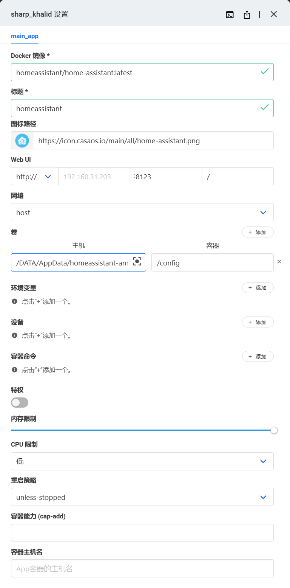
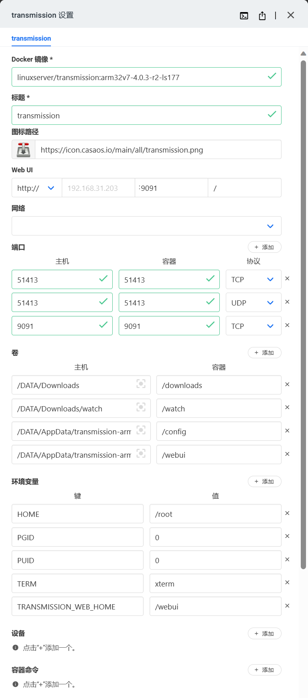

# onecloud

## 主要玩法

玩客云作为一个晶晨S805的终端，其性能有限，玩法限制较多，目前来看主要有以下几种：

1. 刷入英菲克、安卓作为电视盒子。
2. 刷入CoreELEC、EmuELEC作为播放器或游戏盒子（性能很差，不建议）。
3. 刷入Armbian作为个人电脑使用（个人推荐，以下刷机以armbian为例）。


## 刷机

玩客云分为1.0和1.3版本，恩山论坛里有帖子https://www.right.com.cn/forum/thread-4058181-1-1.html 介绍了两个版本的区别，也详细介绍了两个版本刷机方法的区别。一旦完成第一次刷机，后面再刷机就可做到不拆机刷机了。（以下介绍以不拆机刷机为例） 

1. 下载hzyitc大神的直刷包https://github.com/hzyitc/armbian-onecloud
2. USB_Burning_Tool导入底包，勾选bootload，擦除flash选项，并按开始
3. 使用针或图钉等尖端按住玩客云的reset键，公对公USB线一头连接玩客云USB2（靠近网口侧）一头连接电脑
4. 当刷入进度超过4%后松开reset键
5. 100%后先停止再拔出USB线

## Armbian初始化

1.改设备名称

```
hostnamectl set-hostname onecloud
```

​    2. 改密码

```
passwd
```

​    3.换镜像源

```
cp -a /etc/apt/sources.list /etc/apt/sources.list.bak
nano -a /etc/apt/sources.list
```

阿里镜像源：

```
deb http://mirrors.aliyun.com/debian/ stretch main non-free contrib
deb-src http://mirrors.aliyun.com/debian/ stretch main non-free contrib
deb http://mirrors.aliyun.com/debian-security stretch/updates main
deb-src http://mirrors.aliyun.com/debian-security stretch/updates main
deb http://mirrors.aliyun.com/debian/ stretch-updates main non-free contrib
deb-src http://mirrors.aliyun.com/debian/ stretch-updates main non-free contrib
deb http://mirrors.aliyun.com/debian/ stretch-backports main non-free contrib
deb-src http://mirrors.aliyun.com/debian/ stretch-backports main non-free contrib
```

其中stretch需要根据armbian版本更换

​    4.更新

```
apt-get update&&apt-get -y upgrade
```

至此，Armbian初始化完毕

## 安装casaos

### 安装脚本

```
curl -fsSL https://get.casaos.io | sudo bash
```

### 添加第三方软件源

在app store中输入以下地址（针对armv7）并按添加

https://play.cuse.eu.org/Cp0204-AppStore-Play-arm.zip

### 安装alist、青龙面板

直接安装即可，略过

### 安装HA

建议使用自定义安装，设置如下



### 设置HACS-china

建议通过https://github.com/hacs-china/integration/releases/latest/download/hacs.zip 下载后直接复制到/DATA/AppData/homeassistant-arm/config/custom_components 目录下，使用命令行安装可能会出现无法找到集成的情况

### 安装transmission

坑太多，建议使用自定义安装，配置如下（建议安全按照以下来，否则可能403）



### 配置transmissionic

这里我设置了transmissionic主题，在https://github.com/6c65726f79/Transmissionic/releases/download/ 下载最新的webui压缩包，复制到 /DATA/AppData/transmission-arm/config/web目录下

